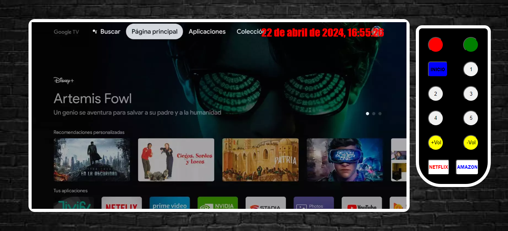

# TV INTERACTIVA

Este proyecto es una simulación de una interfaz de televisión inteligente (Smart TV) utilizando HTML, CSS y JavaScript.

## Instalación

1. **Clonar el repositorio:**

2. **Abrir el proyecto en Visual Studio Code:**

3. **Abrir el archivo HTML en tu navegador web:**

Abre el archivo `index.html` en tu navegador preferido.

## Uso

- Haz clic en los botones del mando para realizar diferentes acciones, como encender/apagar la TV, cambiar de canal, ajustar el volumen y acceder a aplicaciones como Netflix y Amazon Prime.
- La fecha y hora se actualizan automáticamente en la esquina superior derecha de la pantalla.

## Contribución

Si deseas contribuir al proyecto, sigue estos pasos:

1. Haz un fork del repositorio.
2. Crea una nueva rama para tu contribución: `git checkout -b nueva-caracteristica`.
3. Realiza tus cambios y commitea: `git commit -am 'Agrega una nueva característica'`.
4. Haz push a la rama: `git push origin nueva-caracteristica`.
5. Abre un pull request en GitHub.

## Créditos

Este proyecto fue creado por Pablo Serrano y se inspiró en los conceptos de interfaces de Smart TV.

## Licencia

Este proyecto está bajo la Licencia MIT. Ver el archivo [LICENSE](LICENSE) para más detalles.

## Contacto

Si tienes alguna pregunta o sugerencia, puedes contactarme por correo electrónico: pablomanuel93@hotmail.com
